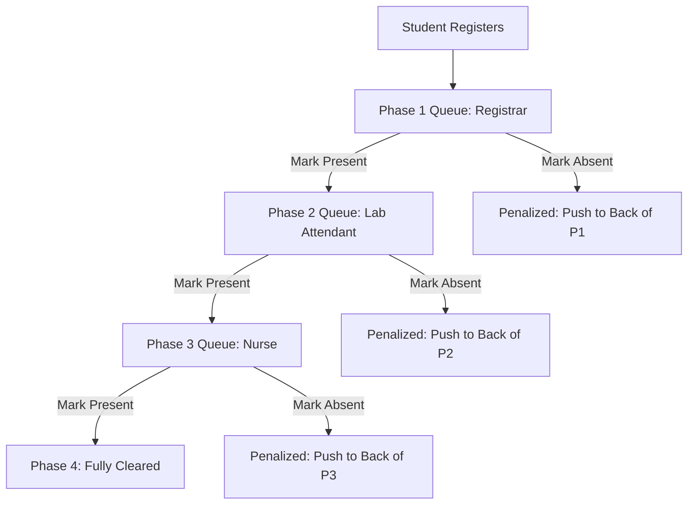

# EKSU Health Center Booking System — FastAPI & MongoDB Atlas Backend Specification Prompt

This document provides a highly detailed, comprehensive specification prompt to guide the development of a production-ready FastAPI backend using **MongoDB Atlas** (with Motor / Beanie ODM) for the role-gated, three-phase EKSU student medical clearance system.

---

## 🛠️ Architecture & Tech Stack

- **Framework:** FastAPI (Python 3.10+)
- **Database Persistence:** MongoDB Atlas (Cloud Database)
- **Database Client & Driver:** `motor` (Asynchronous MongoDB driver for Python) or `Beanie` (Pydantic-based Asynchronous ODM for MongoDB).
- **Data Validation & Schemas:** Pydantic v2.
- **Authentication & Security:** JWT (JSON Web Tokens) with standard OAuth2 password bearer flow. Scopes/Roles are embedded in the token claims.
- **Task Runner / Document Generator:** ReportLab or WeasyPrint for programmatic PDF Clearance Letter generation.
- **Real-Time Capability:** FastAPI WebSockets or Server-Sent Events (SSE) to broadcast queue updates immediately.

---

## 🗄️ MongoDB Collections & Document Schemas

If using **Beanie ODM**, these maps directly to subclassing `beanie.Document`. If using **Motor**, these represent the database sub-document formats.

### 1. `users` Collection
Stores user profiles, roles, and credentials.
- **Indexes:** Unique ascending index on `email`. Unique sparse index on `matric_number`. Unique sparse index on `staff_id`.
```json
{
  "_id": "ObjectId",
  "email": "student_name@eksu.edu.ng",
  "hashed_password": "scrypt/bcrypt_string",
  "name": "Full Name",
  "role": "student", // 'student', 'registrar', 'lab', 'nurse', 'admin'
  "matric_number": "EKSU/2023/1001", // null for staff
  "staff_id": null, // null for students
  "created_at": "ISODate"
}
```

### 2. `student_progress` Collection
Tracks linear screening states, phase numbers, and onboarding status.
- **Indexes:** Ascending index on `user_id`. Ascending index on `current_phase`.
```json
{
  "_id": "ObjectId",
  "user_id": "ObjectId",
  "current_phase": 1, // 1 = Phase 1, 2 = Phase 2, 3 = Phase 3, 4 = Cleared
  "registration_order": 105, // global sequential serial order for queue sorting
  "onboarding_completed": false,
  "phase_numbers": {
    "1": "PH1-0105",
    "2": null,
    "3": null
  },
  "created_at": "ISODate"
}
```

### 3. `schedules` Collection
Defines active hours, processing slot intervals, and daily caps.
- **Indexes:** Compound unique index on `{ "phase": 1, "date": 1 }`.
```json
{
  "_id": "ObjectId",
  "phase": 1, // 1, 2, 3
  "date": "YYYY-MM-DD",
  "start_time": "08:00",
  "end_time": "17:00",
  "duration_per_student": 15, // slot duration in minutes
  "max_students": 40, // capacity cap
  "is_active": true,
  "created_at": "ISODate"
}
```

### 4. `appointments` Collection
Tracks individual stage slot bookings, appointment numbers, and statuses.
- **Indexes:** Ascending index on `student_id`. Ascending index on `status`.
```json
{
  "_id": "ObjectId",
  "student_id": "ObjectId",
  "phase": 1,
  "appointment_number": "PH1-0105",
  "date": "YYYY-MM-DD",
  "time_slot": "09:30",
  "status": "pending", // 'pending', 'attended', 'missed'
  "created_at": "ISODate"
}
```

### 5. `clearances` Collection
Stores nurse sign-off unique verification codes for certificate issuance.
- **Indexes:** Unique index on `clearance_code`. Ascending index on `student_id`.
```json
{
  "_id": "ObjectId",
  "student_id": "ObjectId",
  "clearance_code": "SEC-NURSE-A8F9-2026",
  "issued_at": "ISODate"
}
```

### 6. `notifications` Collection
Holds real-time student and staff warnings/alerts.
- **Indexes:** Ascending index on `user_id`. Ascending index on `is_read`.
```json
{
  "_id": "ObjectId",
  "user_id": "ObjectId",
  "title": "Appointment Confirmed",
  "description": "Your Phase 1 screening slot is successfully locked for tomorrow.",
  "type": "success", // 'info', 'success', 'warn'
  "is_read": false,
  "created_at": "ISODate"
}
```

---

## ⚙️ Core Screening Pipeline & Queue Logic

The backend must strictly enforce linear state transitions.



### 1. Booking Generation
- When a student registers, they receive their base `registration_order` (atomic counter fetched from a dedicated database sequence collection, or dynamically calculated).
- An appointment number for Phase 1 is automatically allocated: `PH1-{registration_order}` (formatted as `PH1-0105` for order 105) and saved inside their `student_progress.phase_numbers`.

### 2. Linear Stage Gating
- A student cannot request a slot or be processed in Phase $N$ unless their `current_phase` is exactly $N$.
- Attempting to skip or bypass phases must trigger a `400 Bad Request` validation error.

### 3. Check-In & Stage Completion (`markPresent`)
- When clinical staff marks a student as **Present**:
  1. The student's `current_phase` is incremented: `current_phase = current_phase + 1`.
  2. If the new phase is $< 4$:
     - A new appointment number for that next phase is generated: `PH{next_phase}-{registration_order}` (inheriting their original serialization rank to reward early registration).
     - The corresponding appointment status for Phase $N$ is updated to `attended`.
  3. If the new phase is $4$ (Fully Cleared):
     - The Nurse's irreversible confirmation triggers the generation of a secure, unique `clearance_code`.
     - The clearance PDF certificate generation task is spawned asynchronously.

### 4. Missed Appointment Penalty (`markAbsent`)
- If clinical staff marks a student as **Missed**:
  1. The student's appointment for the current phase is set to `missed`.
  2. To prevent queue abuse, fetch a new serial: `new_order = global_counter + 1`.
  3. The student receives a **completely new, higher appointment number** for the *same* phase: `PH{phase}-{new_order}`, effectively pushing them to the back of the queue.

---

## 🔒 Security & Endpoint Authorization Gating

Endpoints must require authenticating through JWT Bearer tokens, with scopes enforcing role compliance:

| Endpoint | Allowed Roles | Business Action |
|---|---|---|
| `POST /api/auth/register` | `student`, `admin` | Register a new user account. |
| `POST /api/auth/login` | *All* | Authenticate and obtain JWT. |
| `GET /api/student/dashboard` | `student` | Retrieve active phase status, countdown, and active slot details. |
| `POST /api/student/onboarding`| `student` | Complete baseline onboarding checks. |
| `POST /api/student/request` | `student` | Request slot timing within their active phase's published hours. |
| `GET /api/student/clearance-pdf`| `student` | Generate/download clearance PDF certificate (requires `current_phase == 4`). |
| `GET /api/staff/queue` | `registrar`, `lab`, `nurse` | Retrieve students currently in their phase, sorted by numerical rank. |
| `POST /api/staff/queue/check-in`| `registrar`, `lab`, `nurse` | Mark student present (advances phase, generates next queue slot). |
| `POST /api/staff/queue/miss` | `registrar`, `lab`, `nurse` | Mark student absent (penalizes, pushes to queue end). |
| `POST /api/staff/schedule` | `registrar`, `lab`, `nurse` | Configure & publish slot duration, capacities, and active timing bounds. |
| `POST /api/admin/bulk-upload` | `admin` | Bulk upload official student list from CSV (parses & matches matric details). |
| `GET /api/admin/analytics` | `admin` | Retrieve weekly screening volume distributions and missed rate graphs. |

---

## 📡 Live Broadcasts & WebSockets

- Provide a `/api/queue/ws/{phase}` WebSocket endpoint.
- Whenever a queue action occurs (`markPresent`, `markAbsent`, `setSchedule`), broadcast a JSON packet containing the updated sorted queue array to all connected clients:
```json
{
  "event": "queue_update",
  "phase": 1,
  "queue": [
    { "matric_number": "EKSU/2023/1001", "name": "Student A", "appointment_number": "PH1-0101", "time_slot": "09:30" }
  ]
}
```

---

## 📄 Clearance PDF Specifications
When generating the final Clearance Certificate, compile a highly professional document containing:
1. **EKSU Official Letterhead:** High-res header with university details.
2. **Student Identity Data:** Name, Matric Number, and Faculty.
3. **Screening History:** Clear check marks indicating the date, time, and status of Phase 1, Phase 2, and Phase 3 verifications.
4. **Nurse Digital Sign-Off:** Digital signature representation and the secure `clearance_code`.
5. **Secure Verification Hash:** Unique alphanumeric serial code verifying authenticity.
